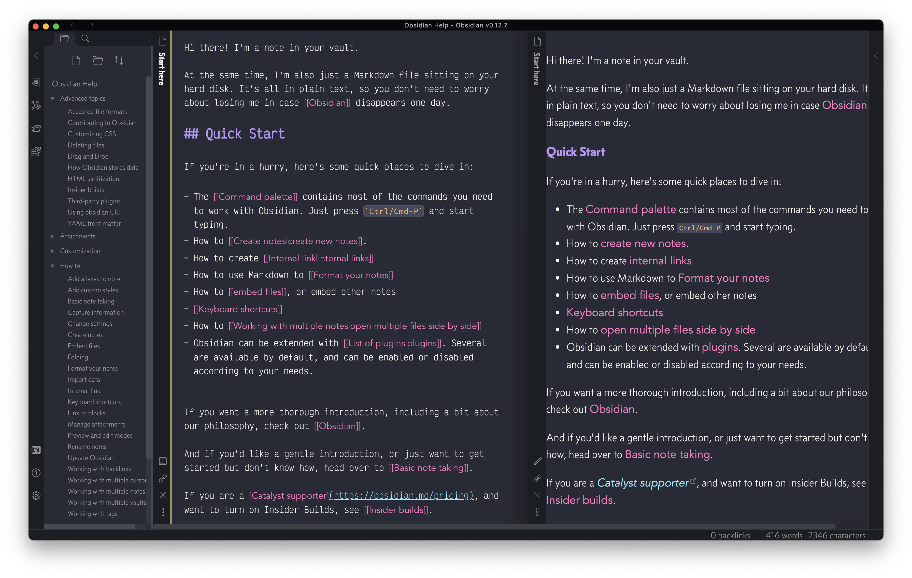

# Centaury theme for Obsidian.md
A theme for [Obsidian](https://obsidian.md/), inspired by and borrowing elements from [Dracula Pro](https://draculatheme.com/pro)

## Install
1. Download Centaury.css to your the themes folder in your Obsidian vault, under `.obsidian/themes`.
2. In Obsidian, click Settings->Appearance and select "Centaury" from the Theme menu.
3. There is no step 3! Enjoy!

